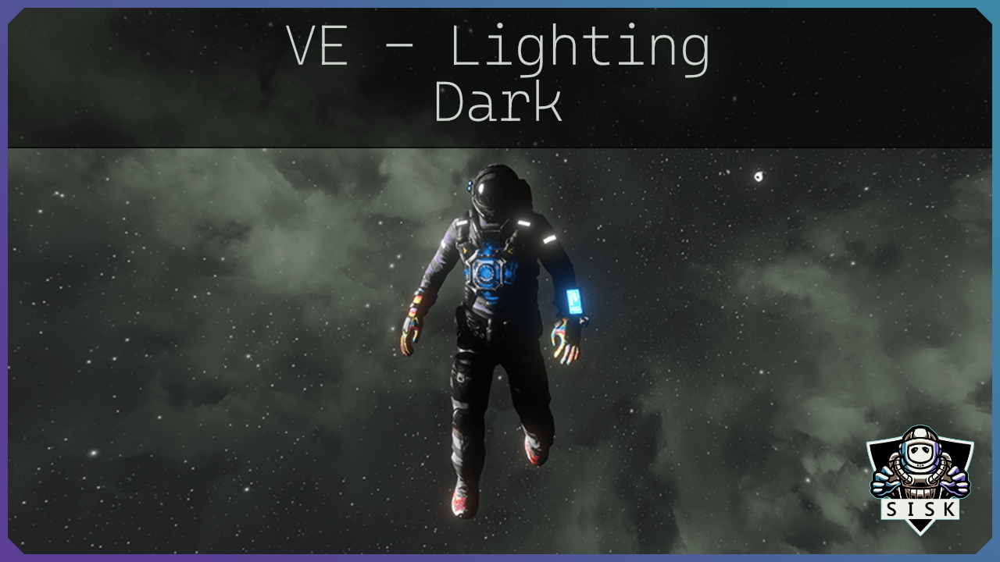

# VE - Lighting Dark

This mod only changes settings regarding light and shadow, but does not contain any Skybox or sun modifications.
It is best combined with a dark skybox.

You can customize your skybox with my [url=https://steamcommunity.com/workshop/filedetails/?id=1380376642] VE Collection [/url].
It includes Skybox, Sun and Environment as seperate mods. They can be combined so that you can build your Skybox to your liking.

These are the same settings I use in my [url=https://steamcommunity.com/sharedfiles/filedetails/?id=1369663583] VE - Preset Purple[/url] mod.

## 🛠︰Load Order ・────────・・・
Unless otherwise stated, the mod load order should be as follows:

* Sun
* Ligthing
* Skybox
* Preset
*Reverse this for dedicated servers*